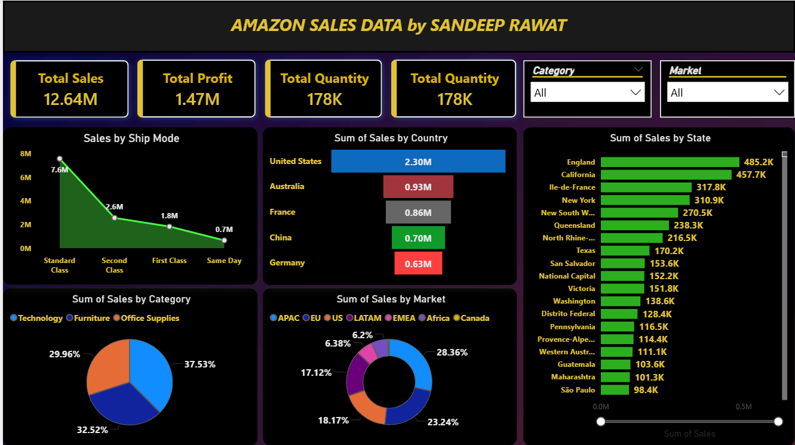

## 📊 Amazon Sales Dashboard

This project presents an interactive Amazon Sales Data Dashboard built to analyze and visualize key business metrics such as sales, profit, quantity, and regional performance. The dashboard provides a clear overview of sales trends and helps in making data-driven decisions.

 

## 🚀 Key Highlights  
💰 Total Sales: 12.64M  
📈 Total Profit: 1.47M   
📦 Total Quantity Sold: 178K      

## 📌 Features   
Sales by Ship Mode:    
Analyze how different shipping methods (Standard, Second Class, First Class, Same Day) impact sales.     
Sales by Country:  
Compare sales performance across countries like the United States, Australia, France, China, and Germany.    
Sales by State:  
Detailed breakdown of sales across multiple states/regions to identify top-performing areas.    
Sales by Category:  
Visual distribution of sales across categories such as Technology, Furniture, and Office Supplies.    
Sales by Market:  
Understand market share across regions including APAC, EU, US, LATAM, EMEA, Africa, and Canada.    

Interactive Filters:   
Category filter   
Market filter  
Enables dynamic exploration of the data.

  

## 🛠️ Tools & Technologies
Power BI (for dashboard creation)  
Data Visualization Techniques  
Data Cleaning & Transformation    

## Dashboard Overview

## 🎯 Purpose

The goal of this dashboard is to:  

Identify top-performing regions and categories    
Track overall business performance   
Provide actionable insights for strategic decision-making   
